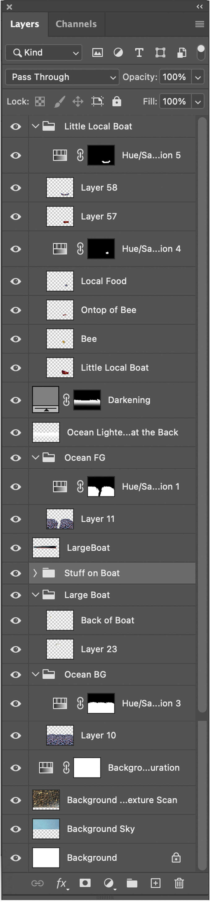

### Project Statement
This project is a digital work created to help bring to light the harm that comes with imported agriculture. The photos were collected at locally grown farmer's markets, at typical grocery stores, and from creativecommons.org. Once the images were collected they were then digitally cut out, edited, and intentionally positioned in order to create the composition. Using these techniques, the piece highlights the increasing dangers and issues that come with the importation of international produce. The United States imports over half of their fruits and over a third of their vegetables from foreign nations. This is typically done in order to lower costs and because of personal desires for any produce year round. Many people tend to shop for groceries without knowing where it came from or even which fruit or vegetables are in season. The problem with this is that imported produce forces domestic producers to lower prices or to even go out of business. Additionally, produce grown internationally sometimes involves unethical conditions for the workers in order to lower costs even more then they already were. The piece tackles this subject by showing a sea of common produce, and a large ship tearing through carrying new unfamiliar foods. 

### Questions for the Class:
1. By just looking at the piece, is the topic easily understood or is context necessary?
2. Are there any parts of the piece that seemed unnecessary and should have not been included?
3. If I were to continue working on the piece is there anything else that should have been included/talked about?

### Photoshop Layers
